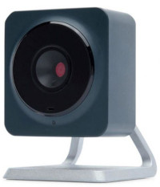
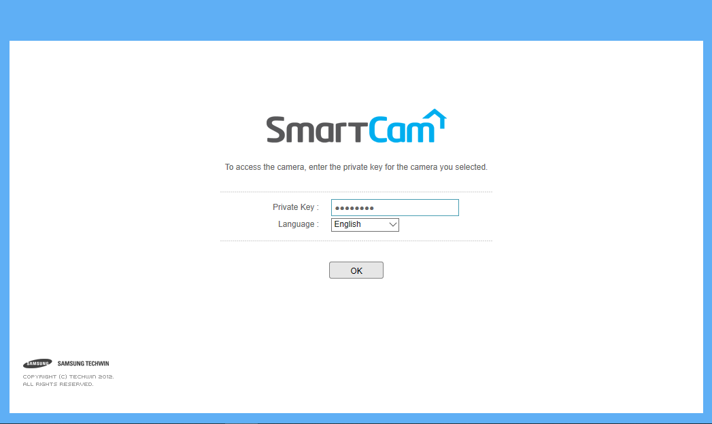
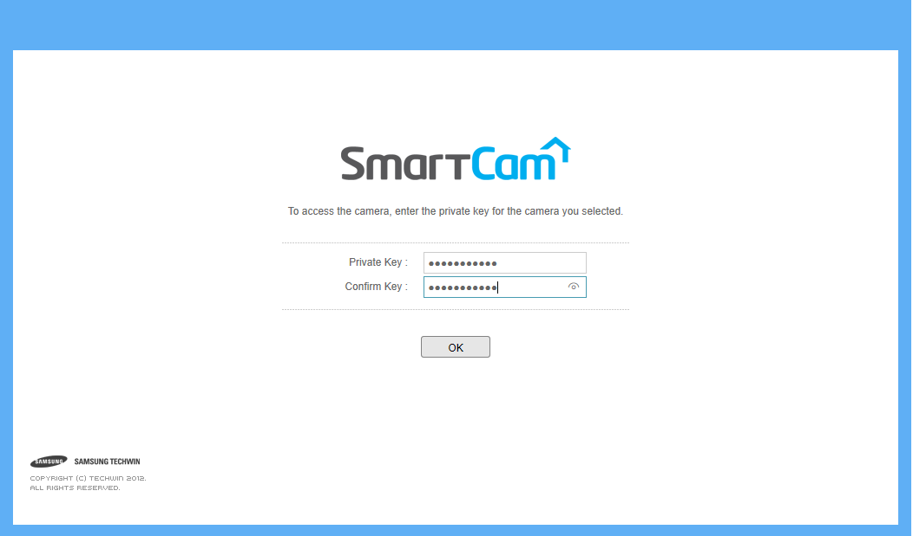
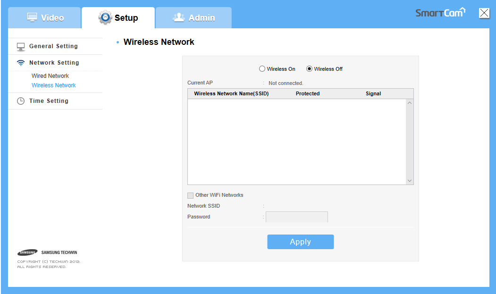
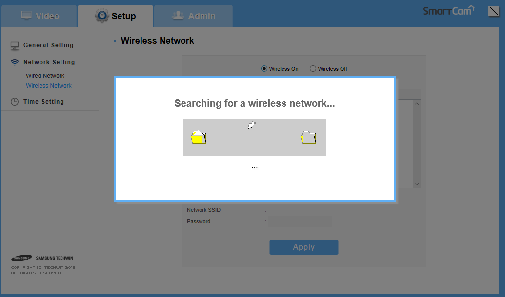
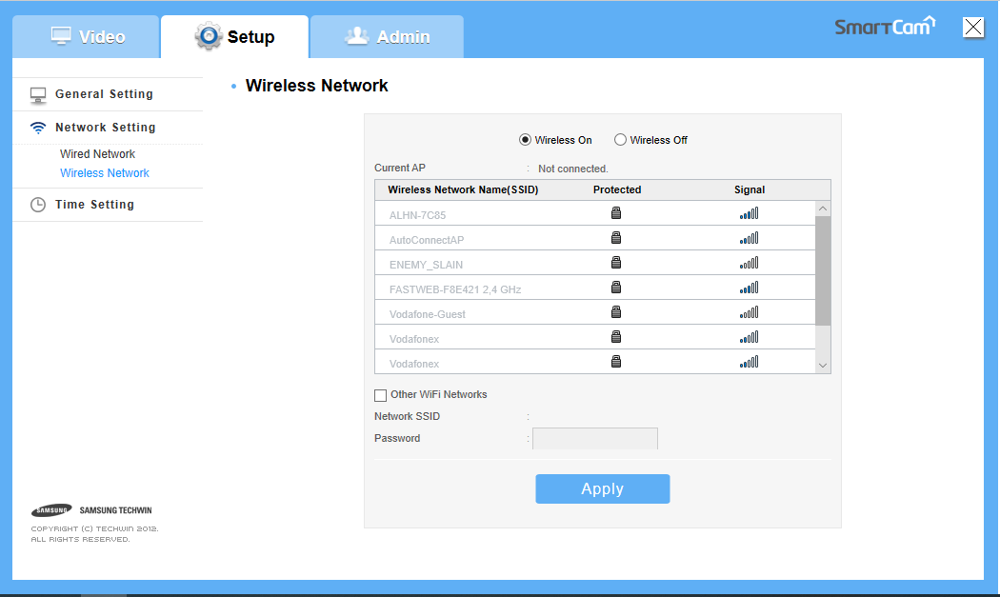
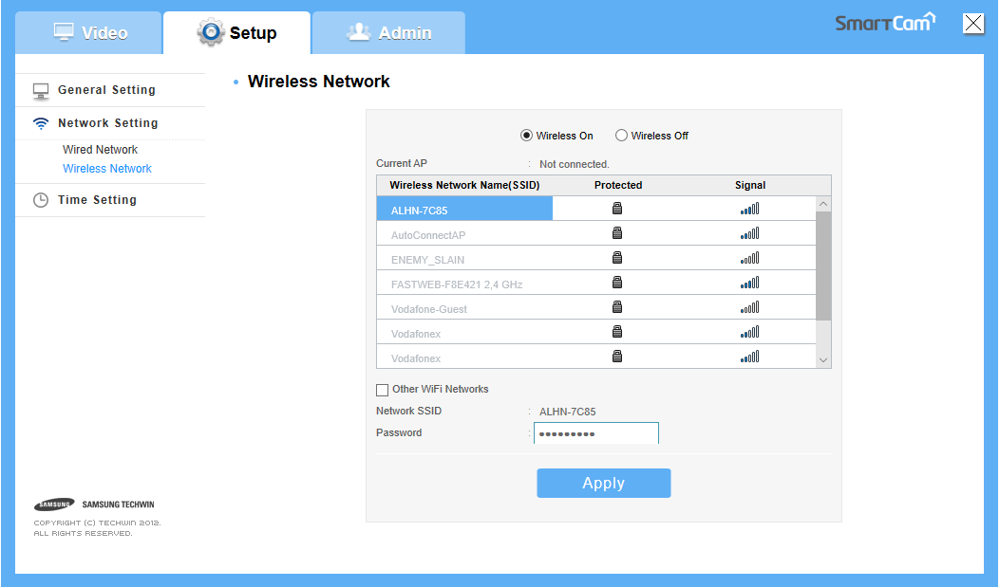
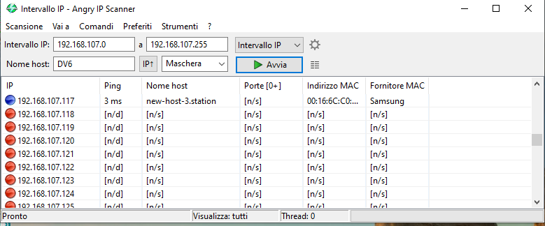

# SNH-C6112BN
 Samsung / Hanwha SNH-C6112BN camera setup instructions  
 

 1. Power on the camera and wait until the led is blue or solid red.  
 2. Press the rear wifi button until the led is green.  
 3. Connect to the DIRECT-CAM-xxxx network, where xxxx are the last 4 digit of the cam serial number on the rear label.  
 4. enter the wifi password that is **smartcam**  
 5. Open a internet browser an insert the address http://192.168.123.1/ that is the wifi network default gateway.  
 I used Windows 10 with internet explorer.  
   
 6. Insert the default Private Key **smartcam**  
 7. When apper a dialog box say that you must change the default Private Key respond yes.  
 8. Insert the new Private Key two times:  
   
 **Write down the new Private Key because if you lose it you cannot connect to the camera. I try reset the camera with the reset pin hole but the Private Key remain my new one and don't return to smartcam!**  
 9. Re login to the camera with the new Private Key and go to Network Setting / Wireless network:  
   
 10. Power on the wirelsee network and waith serching:  
   
 11. Choose a network from the list  
   
 12. Insert the network password:  
   
 13. Apply it and then restart the camera removing the power supply.  
 14. Wait the camera connect to your wifi network, when the light in then camera is solid blue open AngryIp Scanner or another ip scanner in a device conncted to your wifi network and start a search:  
   
 15. Search for a Samsung device that has the MAC address of your camera, the MAC address is write on a label behind the camera.  
 16. You could re login to your camera with the ip that you find on scanner.  
 17. If you use Internet Explorer you can install a plugin for view the images, or use the rtsp address  
 rtsp://admin:**yournewprivatekey**@**yourcameraaddress**/profile1/media.smp  
 with your favourite program like VLC or Obs.

## Video resolution and formats
URL|Video|Resolution|TBR
---|-----|----------|---
rtsp://admin:**yournewprivatekey**@**yourcameraaddress**/profile1/media.smp|mjpeg|1920x1080|1
rtsp://admin:**yournewprivatekey**@**yourcameraaddress**/profile2/media.smp|h264|640x360|10
rtsp://admin:**yournewprivatekey**@**yourcameraaddress**/profile3/media.smp|h264|640x360|30
rtsp://admin:**yournewprivatekey**@**yourcameraaddress**/profile4/media.smp|h264|1280x720|15
rtsp://admin:**yournewprivatekey**@**yourcameraaddress**/profile5/media.smp|h264|1920x1080|30
rtsp://admin:**yournewprivatekey**@**yourcameraaddress**/profile6/media.smp|h264|640x360|30

## Audio format
pcm_mulaw, 8000 Hz, 1 channels, s16, 64 kb/s
